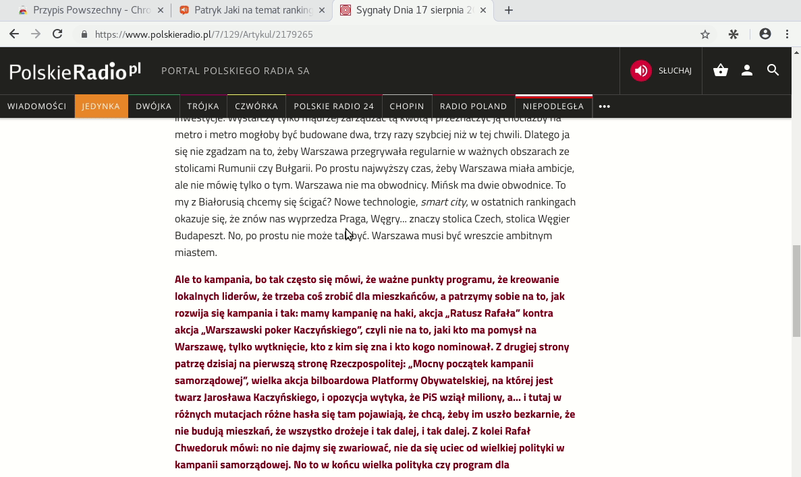

[](https://circleci.com/gh/PrzypisPowszechny/pp-client/tree/master)


1. [About & Preview](#about)
2. [Development](#development)
    - [Prerequisites](#prerequisites)
    - [Building](#building)
    - [Building browser extension ](#building-browser-extension )
    - [Connecting to backend](#connecting-to-backend)
3. [Architecture](#architecture)
4. [More & References](#more)

---

# About

Chrome extension for enhancing websites with annotations available to the visitors at the very moment of reading. 

Using this tool communities focused on fact-checking can serve their content contextually and effectively improve 
the reliability of information people source from the internet.

### Preview of adding an annotation




# Development

## Prerequisites

### Node.js setup

Ubuntu:
```
curl -sL https://deb.nodesource.com/setup_7.x | sudo -E bash -
sudo apt-get install -y nodejs build-essential
```

macOS / Windows - install newest (LTS) version available from [official website](https://nodejs.org/en/).

Install packages

```
npm install
```

## pp-client as a browser extension

Chrome extensions have very clear constraints on their structure.
Although we currently only support Chrome, browser extensions as such have largely been standardized, so we can roughly talk
about browser extensions in general.

Full extension configuration is defined in `manifest.json`.

Parts relevant to our application -- the ones we actually implement:

- background script
- content scripts
- popup window (appearing when the extension icon is clicked)
- extension icon

We further use some resources unique to Chrome extensions
- chrome storage
- chrome message API

## Building

Long story short: for hot reloading development you probably just want to run:
```
npm run start-extension
```

### Introduction

Since content scripts are injected to every page visited by the extension's user,
they are technically very much like regular scripts attached by the website author himself (except we are injecting them, yes).

Exploiting the analogy, we can call this part of the application shortly the **client** part.

### dev / prod configuration
Production configuration and development differences:
- many introduced by default by Webpack 4 itself (which is nice) -- by default it builds bundles differently for development and
production settings
(e.g. minifies bundles in production settings)
- other differences can be introduced by different variables used within the application for dev and prod configuration,
 defined in `config/app-settings`.

## Building browser extension 

### development
Both `build-dev-extension` and `start-extension` will compile to a `dist/browser-extension` directory.

**single build**

```
npm run build-dev-extension
```

**hot reloading**

```
npm run start-extension
```

Go to Chrome extension page and load the extension (to see how to load an extension go to
[Chrome developer docs](https://developer.chrome.com/extensions/getstarted#unpacked)
to **Load the extension** section). Choose `dist/browser-extension` directory as the app root.

A rebuild of the browser package (`dist/browser-extension`) won't normally reload the browser extension already loaded by Chrome.

**If you're using hot reloading**, each change to one of the content scripts or popup window
(to be precise, in Webpack terms -- any dependency of the entry points,
which are marked as either `content_script` or `default_popup` in `manifest.json`) will cause Chrome to reload the extension.

**If you're not using hot reloading**, you need to manually refresh the browser extension in Chrome's extension page.

When the extension has been reloaded, you still need to refresh each opened tab for the change to take effect in that very tab.

As for now, this part of the hot reloading plugin is not fully clear.
It reloads some of the open tabs (I'm not sure how it chooses which).
Most of the time, only the last used.

Needless to say, without hot reloading you need to reload the tab manually.

#### Further notes (but no less important)
- Hot reloading **does not reload anything on the first build**; it's best to start off with running it,
and introduce changes to the code just then, rather than build only when it's needed.
- If you don't see a change you expect to have made in the extension,
**make sure that the tab has in fact been reloaded**
    - it's clearly visible with the devTools open;
    - a separate monitor with the current tab on top is also very handy in subconsciously supervising the refreshing

- if you're not sure the extension has been reloaded by Chrome, you can do it manually;
but rather than use Chrome extension page, it's quicker to use 
[this reloading app](https://chrome.google.com/webstore/detail/extensions-reloader/fimgfedafeadlieiabdeeaodndnlbhid).

### production
```
npm run build-extension
```
Modifies `dist/browser-extension` as a side effect.

A package ready to upload to Chrome Web Store is `dist/pp-chrome.zip`.

## Content script (= client) build


### client + hot reloading + dev configuration
```
npm start
```

### client + prod configuration
```
npm run build
```

## Connecting to backend

This application works with PrzypisPowszechny API server - https://github.com/PrzypisPowszechny/pp.

#### Default instance
By default it's set to connect to a public instance of the development server. 

#### Local instance
If you want to connect to your local instance, add `--env.api=local` arg to the command starting client, e.g.
```
npm run start-extension -- --env.api=local
```
#### Documentation of API

Documentation of the whole REST API is available at **```/api/docs/```** path of the backend.

Here's the online :desktop_computer: **[documentation of the latest release](https://przypispowszechny.pl/api/docs/)**

And to see the shape of the backend you are developing to, when running a backend instance locally, just visit:
```
http://localhost:8000/api/docs/
```

# Architecture


# More

[Development -- details](docs/dev-details.md)

[More notes on building](docs/build.md)

[Annotating DOM](docs/DOM-annotation.md)

[Valuable references](docs/references.md)
